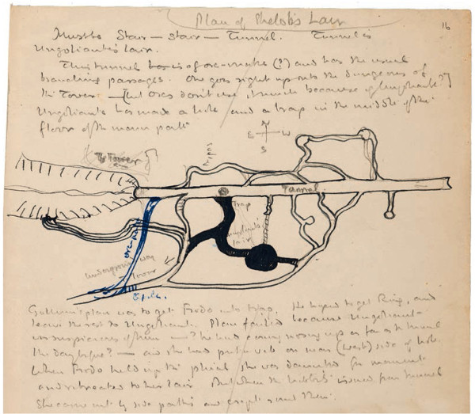
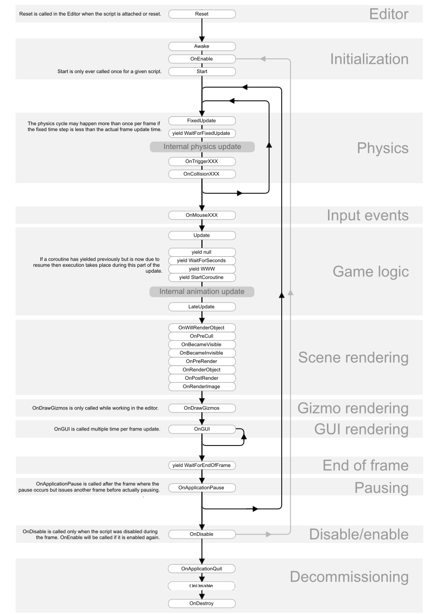
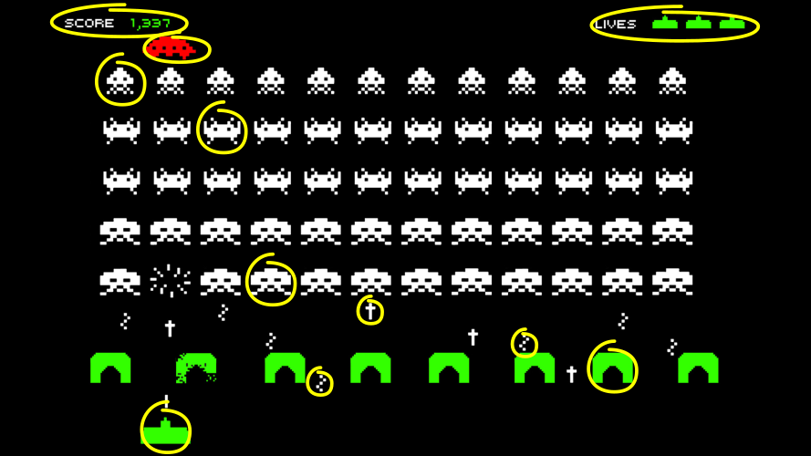
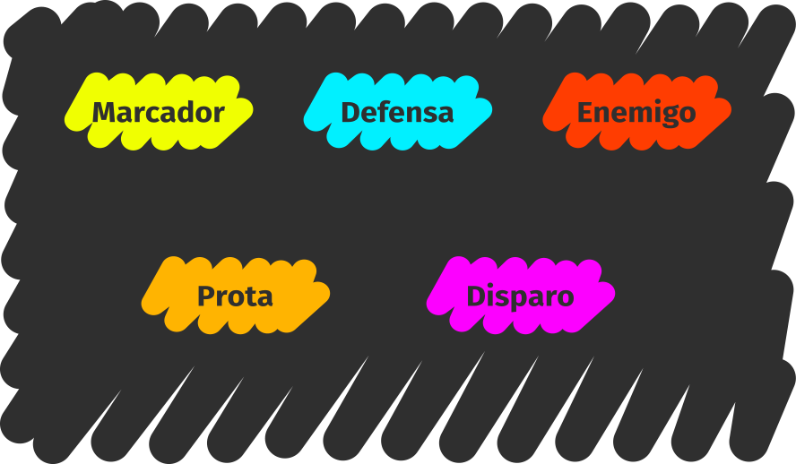
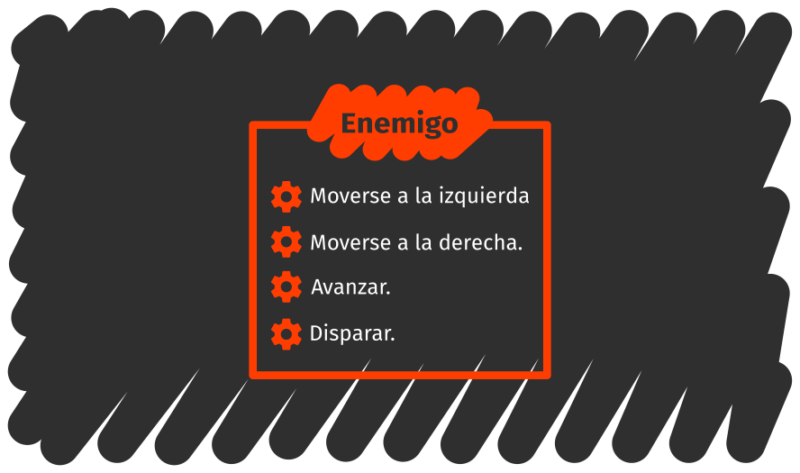

# Object-oriented programming

> OOP to me means only messaging, local retention and protection and
> hiding of state-process, and extreme late-binding of all things.

[Alan Kay on object-oriented programming](http://userpage.fu-berlin.de/~ram/pub/pub_jf47ht81Ht/doc_kay_oop_en)

## Problem modeling

Programming is expressing a problem in a given programming language. Modeling represents a halfway step through the process, where the important aspects of a problem are captured and organized.

The modeling of a problem is independent from the chosen programming language, but this choice has an impact on how easy it will be for you to codify the model.

Many creative activities employ intermediate models between reality and its final expression on the medium. For instance, _storyboards_ are used in the planning of action sequences; they capture the key moments in the sequence.

This map, which depicts Shelob's Lair from The Lord of the Rings, was employed to maintain coherence in the described scenario.

This is a design for a map from the video game _Mario_. Digital tools have enabled the automation of models in software.

And here's the flowchart for how the different functions of a Unity script are called.

Object-oriented programming is a **problem modeling** technique that emphasizes two concepts: **objects** and **message passing**.

## Objects

Objects are **depictions of a problem's aspects** which carry out a specific role, exhibit a set of specific functionality –the [API](https://en.wikipedia.org/wiki/Application_programming_interface#Libraries_and_frameworks)–, and also hide the way they carry out that functionality.

## Message passing

Messages are **action requests** from one object to another. These requests issue from a sender object to a target object, and they codify which **API functionality** is required.

## Object-oriented modeling

Object definitions and the interactions between objects model the problem. Throughout this section we shall informally model the video game [_Space Invaders_](https://en.wikipedia.org/wiki/Space_Invaders).

### Identifying objects

A technique for object identification is to **give names**.

These are some objects you could give a name: allied ship, enemy 1, enemy 2, enemy 3, friendly bullet, enemy bullet 1, enemy bullet 2, defense 1, defense 2, remaining ship counter, score counter.

### Types of objects and instances

It is clear at a glance that many concrete objects belong into families or **types** of objects. It is convenient to remember that these are also called **classes**.

Types **specify properties and common behaviors** to all of their belonging objects, though these may be different from each other individually.

Some **types** you could identify are counters, shields, friendly ship, enemies, and bullets.

A type's **values** are each of the individual objects. The special enemy, as well as each of the other enemies, will be a distinct value of the **enemy type**.

When you use the class terminology, values will become **class instances**.

In object models, it is more convenient to work with object types.

### Methods & interfaces

In order to try to determine the API for the types of objects, you can use the game's interactions as a guide.

<iframe width="560" height="315" src="https://www.youtube.com/embed/D1jZaIPeD5w?rel=0" frameborder="0" allowfullscreen></iframe>

For example:

> The enemies all move together towards one side of the screen; they advance
> one row and then they move towards the other side all the while they fire
> at random.

This time the technique is to **look for verbs**: _move_, _advance_, and _fire_, for instance.

In order to implement enemy behavior, enemies have to be able to move to the sides, advance and fire. Therefore, they will need to allow to be sent messages requesting any of these operations.

The actions an object can carry out are called **methods**.

### State & attributes

Objects can not only carry out actions, but they also capture **characteristics** of the entities they represent.

Every enemy, for instance, has a distinct graphic, a different score value, an on-screen position, and also keeps track of which direction it was moving in.

The **state** is not usually exposed outright in the API. Think of the enemies' case: even if these do have a position, it is preferable to have specific methods for modifying their position (such as "move left" and "move right") instead of just giving free access to their position.

An object's characteristics are called **attributes**.

The modeling process is iterative: in defining some actions, we introduce new names such as _position_ or _direction_, which in turn become new types of objects.

### Constructors and object creation

Let's consider the shooting interaction now:

> When the player presses the fire button, a bullet appears in front of the
> friendly ship and advances until reaching the top of the screen or
> colliding with an enemy.

The bullet was not there before, and it will have to be created in the moment of firing.

As another example, the level's arrangement before the game starts:

> 55 enemies show on screen; 5 rows of 11 each in the following pattern: 1
> row of type 1 enemies, 2 rows of type 2 enemies, 1 of type 3s, and 1 of
> type 4s.

It is clear we do not want to write each and every one of the 55 enemies; and since they all belong to the enemy type, it is also obvious they will all be very similar.

What we need is an **automatic object generation** mechanism. Every language offers its own way of creating objects.

A useful mechanism is to rely on a new object, the **constructor**, whose task is to generate objects of a certain type. There is, therefore, **one constructor for every type**.

Constructors have a very simple API: _new object_. This method creates a new object of a given type.

Constructors usually allow the customization of parts of the object they create, so that they can be told something along the lines of _"create a bullet with this position, this graphic and this direction of movement"_.

### Relations between types

During modeling, relations arise in a natural way. Enemies _have_ a position. The friendly ship _creates_ bullets.

As is often our habit, you will tend to **set hierarchies** between objects by creating more general types. For instance, instead of thinking of enemies and player separately, it is possible to think of _ships_.

The **`ship` type** compounds the methods and attributes common to the player ship and the enemies.

This hierarchy establishes **inheritance relations**, also called _"it's a(n)"_ since the player ship is a `ship`, and the enemy is a `ship` as well.

We say the `enemy` type **extends** the `ship` type by adding `advance` to the API, as well as the score value and last movement direction to the state.

The friendly ship adds no new methods but **redefines or overrides** the `shoot` method so that it fires upwards.

Since there are new types, you will need new constructors. Old constructors can **delegate** parts of the object creation to the new ones.

This way, when we request an enemy, the enemy constructor will request a ship from the ship constructor. It will then take that ship, modify it so that it becomes an enemy, and return it as an enemy.

