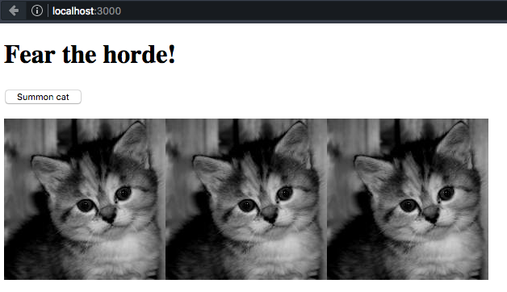

# Exercises

Complete these exercises in order and try to answer the proposed questions.

Remember you can always look up the documentation (for instance), [the MDN](http://developer.mozilla.org)), search the Internet, etc.

**Important**: each exercise will as you to create an HTML file, a JavaScript and possibly a CSS one. **You must create new files**, not reuse the ones for previous exercises. If you want to keep the exercise files, you can create a different directory for each.

## Exercise 1. Execute JavaScript on the browser

Create an `index.html` file with the following content:

```html
<html>
<head>
    <title>Exercises</title>
    <meta charset="utf-8">
    <script src="main.js"></script>
</head>
<body>
</body>
</html>
```

Create `main.js` too (you may notice we include it from the HTML file, with the `<script>` tag) with the following:

```javascript
console.log("Hello, world!");
```

Open the file in the browser, and you will see it shows up blank, since the HTML is empty. But if we open the **browser console**, we can see the message we have written from the JavaScript file.

In Firefox Developer Edition, you can open up the development tools with `Ctrl + Shift + I` (or `⌘ + ⌥ + I` ), or from the menu `Tools / Web Developer / Toggle Tools`. Several panels will show up with different tools, among them the **console**, which you can enable by clicking on its tab.


Now we shall modify the HTML dynamically so that written text will show on screen.

Add the following to the JavaScript file, `main.js`:

```javascript
document.body.innerHTML = '<h1>Hello, world!</h1>';
```

Then try reloading… and the page still shows up blank! However, if we replace the previous line with the following block, the problem is fixed:

```javascript
window.onload = function () {
    document.body.innerHTML = '<h1>Hello, world!</h1>';
};
```


---

**Question**: Why does this happen?

Resources:

- [`window.onload`](https://developer.mozilla.org/en/docs/Web/API/GlobalEventHandlers/onload) (MDN)

## Exercise 2. Summoning a horde of cats

This exercise consists of creating an image on the fly on the press of a button, and adding it to the page.

Create an `index.html`:

```html
<html>
<head>
    <title>Exercises</title>
    <meta charset="utf-8">
    <script src="main.js"></script>
</head>
<body>
    <h1>Fear the horde!</h1>
    <p><button type="button" id="summon">Summon cat</button></p>
    <p id="kittens"></p>
</body>
</html>
```

Now for `main.js`. First, we shall check for clicks on the button:

```javascript
window.onload = function () {
    var button = document.getElementById('summon');
    button.addEventListener('click', function () {
        console.log('Summon!');
    });
};
```

Execute the code on the browser, and check whether the `Summon!` message shows up on the console.

Once we have detected the event, we shall dynamically create an image and then add it to the DOM so that it displays on screen. Replace the content of the callback function (the line that was printed out on the console) with the following:

```javascript
var img = new Image();
img.src = 'https://placekitten.com/g/200/200/';
document.getElementById('kittens').appendChild(img);
```

Check out whether a new image is inserted with each click on the button:



---

**Exercises**: instead of creating an `Image` object, modify the code so that it directly inserts HTML as paragraph content with `id` `kittens`.

Resources:

- [`Element.innerHTML`](https://developer.mozilla.org/en-US/docs/Web/API/Element/innerHTML) (MDN)
- [``](https://developer.mozilla.org/en-US/docs/Web/HTML/Element/img) (MDN)

Considerations:

- Keep in mind `innerHTML` is both a read property and a write property.
- You can concatenate strings by using the `+` operator. E.g.: `'hello, ' + 'world'`.
- In this case, using `Image` yields no advantage over creating the object via HTML. `Image` is usually employed when we need to subscribe to an event of the image (e.g., `load`), or we need to access its properties via JavaScript.

## Exercise 3. Styles, forms and custom attributes

In this exercise, we shall display a list of characters and use a form to select which of them we want to "kill". Additionally, we shall display dead characters with a different appearance.

### Step 1. Setup

We shall start from the following HTML file:

```html
<!doctype html>
<html>
<head>
    <title>Ejercicios</title>
    <meta charset="utf-8">
    <link rel="stylesheet" href="styles.css" type="text/css">
    <script src="main.js"></script>
</head>
<body>
    <h1>Kill monsters</h1>
    <ul id="party-monsters">
    </ul>
    <form name="killing-machine">
        <p>
            <select name="chara"></select>
            <button type="submit">Kill!</button>
        </p>
    </form>
</body>
</html>
```

We shall also create `styles.css`, containing the following:

```css
.dead {
    text-decoration: line-through;
}
```

### Step 2. Inserting content dynamically

We shall perform this step with JavaScript, from a `main.js` file. What we shall do is fill in the character list with the data from a **party**, as well as customizing the form's dropdown controls (the `<select>`) so that it too can display the character list.

We shall first create the party data. For instance:

```javascript
var party = [
    {name: 'Bat', id: 'bat1'},
    {name: 'Slime', id: 'slime'},
    {name: 'Bat', id: 'bat2'}
];
```

With this we can now fill in the list, `<ul>`:

```javascript
window.onload = function () {
    var list = document.getElementById('party-monsters');
    party.forEach(function (character) {
        var li = document.createElement('li');
        li.innerHTML = character.name + ' (<code>' + character.id + '</code>)';
        list.appendChild(li);
    });
};
```

In order to add "lines" to the dropdown controls, that is to say the `<select>`, we must use `<option>` elements. The text contained in the tag will be the one that displays on the menu. However, in order to know the selected _value_, we need to add a `name` attribute to `<option>`, and this string is the one the `<select>` element will return when we ask it which option is the one it currently has selected.

This would be the sample HTML for a `<select>` (do not copy it, it is just an example):

```html
<select name="size">
    <option value="size-s">Small</option>
    <option value="size-m">Medium</option>
    <option value="size-l">Large</option>
</select>
```

Should the user select the option `Medium`, `<select>` would return the value `size-m` when asked about the selected option.

Now that we know this, we shall generate a `<select>` containing the characters in the party. We shall use their names as the display text, and their ID as the value for that option.

```javascript
var select = document.querySelector('select[name=chara]');
party.forEach(function (character) {
    var option = document.createElement('option');
    option.innerHTML = character.name;
    option.value = character.id;
    select.appendChild(option);
});
```

If you run the code, you shall see the following:


Visually, everything looks alright, but we are going to make sure all of the `<option>`s effectively have the `value` we want.

To this end, right-click on the `<select>` and select the `Inspect Element` element from the context menu. The developer tools will open up (if they were not already), with the Inspector as active panel.


Click the arrow on the left to unfold the content of that DOM node:


Check whether the `value`s are the right ones.


### Step 3. Intercepting the form

Try selecting a character and hitting the _Kill_ button. You will see that the page reloads, but the URL is a bit different:


What is happening here is that a question mark, followed by the names of the form's fields with their values, has been added. In this case we can see `chara=slime` because our `<select>` porque nuestro `<select>` has the `name` attribute set to `chara`, while `slime` is the `value` for the selected option.

This string (`?chara=slime`) is known as **querystring**, and its purpose is to pass request parameters to the server. We are not programming a server, and only want to obtain the form's value in order to perform an action _on our side_ (that of the Web client).

This is fixed by intercepting the `submit` event from the form and cancelling it so that the browser will not make a new request to the server, reloading the page:

```javascript
var form = document.querySelector('form[name=killing-machine]');
form.addEventListener('submit', function (event) {
    event.preventDefault();
    console.log('Killed character');
});
```

Notice how the button no longer reloads the page, but rather prints out a message on the console.

Now we shall retrieve the character's ID by looking up the value selected on `<select>`. To do this, all we need to do is access its `value` property. Replace the callback in `submit` with the following:

```javascript
event.preventDefault();
var charaID = form.querySelector('[name=chara]').value;
console.log('Killed character:', charaID);
```

In the console, notice how the ID is different depending on the option that is selected.


### Paso 4. Atributos data para mapear elementos

En este paso, añadiremos una clase CSS al elemento de la lista que corresponda cuando matemos a un personaje. Así, lo marcaremos como muerto.

¿Cómo podemos hacer para relacionar el valor seleccionado con otro nodo HTML?

Podríamos añadir un atributo ID a los elementos de la lista y luego utilizar `getElementById` para seleccionar ese elemento y manipularlo. El problema es que **las ID's tienen que ser únicas**. Para este ejemplo nos valdría, ¿pero qué pasa si necesitamos renderizar esa misma party en otra parte de la página?

La solución es _inventarnos_ un **atributo HTML a nuestra elección** y guardar ahí la ID del personaje (¡o cualquier otro valor que queramos!). Podemos añadir uno o más atributos personalizados a cualquier etiqueta HTML, el único requisito es que tengan el **prefijo `data-`**. Tendríamos así elementos renderizados de esta manera:

```html
<li data-charaid="bat1">...</li>
```

Así, podríamos acceder a este elemento utilizando `querySelector('[data-chara-id=bat1]')`, por ejemplo.

Estos atributos se llaman _data attributes_. Podemos acceder a ellos desde JavaScript con la propiedad `dataset`, que contiene un mapa en la que los nombre de los atributos (_sin_ el prefijo `data-`) son las _keys_. En este ejemplo, `li.dataset.charaid` nos devolvería `bat1` (asumiendo que `li` es el elemento `<li>` que queremos).

Primero debemos añadir este atributo data cuando rellenamos la lista:

```javascript
var li = document.createElement('li');
li.innerHTML = character.name + ' (<code>' + character.id + '</code>)';
li.dataset.charaid = character.id;
list.appendChild(li);
```

Puedes comprobar que el atributo está puesto correctamente usando el inspector:


Ahora modifica el callback de `submit` del siguiente modo:

```javascript
event.preventDefault();
var charaID = form.querySelector('[name=chara]').value;
var li = list.querySelector('[data-charaid=' + charaID + ']');
li.classList.add('dead');
```

Con esto, cada vez que se pulse el botón se añade la clase CSS `dead` al elemnto `<li>` que contenga el personaje seleccionado. En el archivo CSS `styles.css` hemos creado antes una regla que muestra a los elementos con clase `dead` con el texto tachado:


---

**Ejercicio**: prueba a desactivar el botón de kill si la opción seleccionada del `<select>` es un personaje que ya está muerto.

- Desactiva el botón nada más matar al personaje, poniendo la propiedad `disabled` de `<button>` a `true`.
- Subscríbete al evento `change` de `<select>`, que se dispara cuando el valor seleccionado cambia.
    1. Averigua si el `<li>` del personaje correspondiente tiene la clase `dead`. Para ello, utiliza el método adecuado de la [propiedad `classList`](https://developer.mozilla.org/en/docs/Web/API/Element/classList).
    2. Cambia la propiedad `disabled` de `<button>` en función de si el personaje está vivo todavía o muerto.

Recursos:

- [`Event.preventDefault`](https://developer.mozilla.org/en-US/docs/Web/API/Event/preventDefault) (MDN)
- [Using data attributes](https://developer.mozilla.org/en/docs/Web/Guide/HTML/Using_data_attributes) (MDN)
- [`Element.classList`](https://developer.mozilla.org/en/docs/Web/API/Element/classList) (MDN)


Notas:

- Podemos usar `querySelector` sobre cualquier elemento del DOM, no sólo sobre `document`. En este caso, limitaremos la búsqueda sólo a sus hijos.

## Ejercicio 4. Estado de la _party_

Vamos a pintar ahora el estado de la _party_ de la práctica anterior en un `<canvas>`.

### Paso 1. Adapta el ejercicio anterior

Modifica tu fichero HTML para cambiar el título, el texto del botón e incluir un elemento `<canvas>` como se muestra a continuación:

```html
<!doctype html>
<html>
<head>
    <title>Ejercicios</title>
    <meta charset="utf-8">
    <link rel="stylesheet" href="styles.css" type="text/css">
    <script src="main.js"></script>
</head>
<body>
    <!-- ¡Cambia el título! Vamos a matar a los monstruos, pero despacito. -->
    <h1>Attack the monsters!</h1>
    <canvas width="800" height="600"></canvas>
    <ul id="party-monsters">
    </ul>
    <form name="killing-machine">
        <p>
            <select name="chara"></select>
            <!-- También hemos cambiado el texto del botón. -->
            <button type="submit">Hit!</button>
        </p>
    </form>
    <section class="resources">
      
    </section>
</body>
</html>
```

Modifica el fichero CSS también para añadir la siguiente regla y ocultar las imágenes:

```css
.resources {
  display: none;
}
```

Y finalmente, abre el fichero `main.js` y modifica la _party_ para incluir los puntos de vida:

```javascript
var party = [
    {name: 'Bat', id: 'bat1', hp: 10, maxHp: 20},
    {name: 'Slime', id: 'slime', hp: 50, maxHp: 50},
    {name: 'Bat', id: 'bat2', hp: 5, maxHp: 20}
];
```

Modifica el _callback_ de `submit` de la siguiente forma para que en vez de matar directamente, dirija un ataque contra el enemigo de 5 puntos de vida:

```javascript
event.preventDefault();
var charaID = form.querySelector('[name=chara]').value;
var character = findCharById(charaID);
character.hp -= 5;

if (character.hp <= 0) {
    character.hp = 0; // corrige el valor en caso de que sea negativo.
    var li = list.querySelector('[data-charaid=' + charaID + ']');
    li.classList.add('dead');
}
```

La función `findCharById` queda así:

```javascript
function findCharById(charaID) {
    return party.filter(function (char) { return char.id === charaID; })[0];
}
```

Ahora necesitarás más de un click para acabar con un enemigo. Puedes usar el depurador para ver cómo los enemigos pierden vida a cada click.

### Paso 2. El bucle de renderizado

Lo que vamos a hacer ahora es implementar un bucle de renderizado muy sencillo. Como ya hemos visto en los artículos de teoría, no podemos hacer algo como:

```javascript
while (true) {
    renderParty();
}
```

La razón es que bloquearíamos el hilo principal y dejaríamos la página inutilizada. Lo que tenemos que hacer es programar un renderizado a cada _frame_ utilizando `requestAnimationFrame`. Dentro de la función `onload` añade lo siguiente:

```js
var lastRender = 0;
var canvas = document.querySelector('canvas');
var context = canvas.getContext('2d');

function render() {
    requestAnimationFrame(function (t) {
        // Borra todo...
        context.clearRect(0, 0, 800, 600);
        // ...y repinta.
        renderParty();
        console.log('Delta time:', t - lastRender);
        lastRender = t;
        render();
  });
}

function renderParty(t) {
    console.log('Pintando la party en tiempo', t);
}

render();
```

Observa la salida por consola. **¿Qué representa la cantidad impresa?**

### Paso 3. Pintar el fondo

Vamos a esbozar en qué consiste pintar la party. Eso es fácil. Cambia el código de `renderParty` para que sea:

```javascript
function renderParty(t) {
    renderBackground();
    renderCharacters(t); // pásale t a la función que pinta los enemigos.
    renderUI();
}

var bgImage = document.getElementById('background');
function renderBackground() {
    console.log('Pintando el fondo.');
}

function renderCharacters(t) {
    console.log('Pintando a los personajes.');
}

function renderUI() {
    console.log('Pintando la interfaz.');
}
```

**Nota**: mucho ojo con utilizar `console.log` dentro de las funciones de render. Hacer esto 60 veces por segundo puede degradar el rendimiento de la aplicación si tienes las herramientas de desarrollador abiertas.

Ahora vamos a pintar el fondo. Cambia la función `renderBackground` para que sólo incluya el siguiente código:

```js
context.drawImage(bgImage, 0, 0)
```

### Paso 4. Pintar los enemigos

Pintaremos los enemigos con primitivas gráficas. El _slime_ será un círculo verde y el murciélago un círculo azul. Si alguno de los personajes está muerto, lo pintaremos en gris. Borra el log y modifica la función `renderCharacters` para que incluya:

```javascript
var charaSpace = 800 / party.length;
var centerOffset = charaSpace / 2;
party.forEach(function (char, index) {
    var x = index * charaSpace + centerOffset;
    var y;
    if (char.hp === 0) {
        context.fillStyle = 'grey';
        y = 500; // en el suelo porque está muerto.
    } else if (char.name === 'Bat') {
        context.fillStyle = 'blue';
        y = 50 * Math.sin(t/100) + 300; // flotando en el aire.
    } else if (char.name === 'Slime') {
        context.fillStyle = 'green';
        y = 400; // en el suelo pero no en la tumba.
    }
    context.beginPath();
    context.arc(x, y, 50, 0, 2 * Math.PI);
    context.fill();
});
```

### Paso 5. Pintar la UI

Falta pintar unas barras de vida justo debajo de cada enemigo. Para ello, reemplaza el contenido de la función `renderUI` por el siguiente:

```javascript
var width = 100;
var semiWidth = width / 2;
var height = 20;
var semiHeight = height / 2;
var charaSpace = 800 / party.length;
var centerOffset = charaSpace / 2;

party.forEach(function (char, index) {
    var x = index * charaSpace + centerOffset;
    var y = 500;
    if (char.hp > 0) {
        var lifeArea = Math.floor(char.hp / char.maxHp * width);
        context.fillStyle = 'red';
        context.fillRect(x - semiWidth, y - semiHeight, lifeArea, height);
        context.lineWidth = 3;
        context.strokeStyle = 'black';
        context.strokeRect(x - semiWidth, y - semiHeight, width, height);
    }
});
```

---

**Ejercicio**: modifica los `hp` de la lista `party` para que estén al máximo y haz que cuando reciban un golpe la barra se anime hasta el nuevo valor.

Recursos:

- [requestAnimationFrame](https://developer.mozilla.org/en-US/docs/Web/API/window/requestAnimationFrame)
- [`CanvasRenderingContext2D.clearRect`](https://developer.mozilla.org/en-US/docs/Web/API/CanvasRenderingContext2D/clearRect)
- [`CanvasRenderingContext2D.fillRect`](https://developer.mozilla.org/en-US/docs/Web/API/CanvasRenderingContext2D/fillRect)
- [`CanvasRenderingContext2D.fillStyle`](https://developer.mozilla.org/en-US/docs/Web/API/CanvasRenderingContext2D/fillStyle)
- [`CanvasRenderingContext2D.strokeRect`](https://developer.mozilla.org/en-US/docs/Web/API/CanvasRenderingContext2D/strokeRect)
- [`CanvasRenderingContext2D.strokeStyle`](https://developer.mozilla.org/en-US/docs/Web/API/CanvasRenderingContext2D/strokeStyle)
