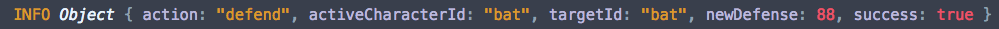
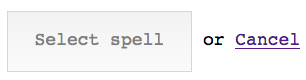
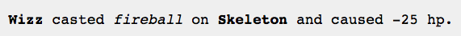

# Guide

_Note: read first the [practice formulation](index.md) before reading this document._

This is a step-by-step guide with suggestions toward approaching the practice. It is advisable to read **this whole document**, especially the _Considerations_ section, before getting started on the first step.

It is also recommendable to have a fresh memory of the API from the previous practice on RPG battles with Node; review the practice formulation or its source code.

Should you get stuck wondering which API calls to make during the development of this practice, you can always check with the `index.js` file from the previous practice, where there is a programmed client of the aforementioned API.

## 1. Displaying the characters

In the starter HTML code, there are two lists `<ul class="character-list">` which you have to fill with `<li>` elements, one per character. We need to indicate the character's name along with her hit and mana point attributes. Further on, it will be useful to be able to refer to that character, so it is best to store her character ID to an attribute.


```html
<ul class="character-list">
    <!-- ... -->
    <li data-chara-id="bat 2">
        bat (HP: <strong>5</strong>/5, MP: <strong>0</strong>/0)
    </li>
</ul>
```

Although the `<ul>` lists are created in the HTML file, we still need to fill in their content, which is something we have to do dynamically with JavaScript. We can access the character views (`CharactersView`) of the characters in a party with  `Battle.prototype.characters.allFrom`.

Since the contents of these lists will have to be updated, it is convenient to implement a function that will do this; then we will be able to call it from elsewhere.

For the time being, we can begin by displaying the characters at the start of every turn. To do this, we need to subscribe to the `turn` event from `Battle`.


### Related documentation

- [`Element.innerHTML`](https://developer.mozilla.org/en-US/docs/Web/API/Element/innerHTML) on the MDN.
- [`Document.querySelector`](https://developer.mozilla.org/en-US/docs/Web/API/Document/querySelector) on the MDN

## 2. Displaying the selected character

The CSS is set up so that an element with the class `active` is highlighted, indicating it is that character's turn.

In the callback of the `turn` event from `Battle`, we get the info from every turn. One of the data points of the event is the active character's ID, with which we can use a `querySelector` in order to select that character's `<li>` and add the `active` class to her.


### Related documentation

- [`Element.classList`](https://developer.mozilla.org/en/docs/Web/API/Element/classList) on the MDN
- [Using data attributes](https://developer.mozilla.org/en/docs/Web/Guide/HTML/Using_data_attributes) (guide on the MDN)

## 3. Displaying the battle action menu

Within the section `<section class="battle-menu">` we can find three forms, which are hidden from display thanks to the inline style `display: none`. Each form represents a "stage" of the battle menu, and presents a list of options to the player.

A list of the options that are available at any given time can be obtained with the `list` method of `Battle.prototype.options`. With this list, we can generate a series of radio buttons so that the player can choose her desired option.

This list of radio buttons will look like this, though it has to be dynamically generated with JavaScript:

```html
<ul class="choices">
    <li><label><input type="radio" name="option" value="attack"> attack</label></li>
    <li><label><input type="radio" name="option" value="defend"> defend</label></li>
    <li><label><input type="radio" name="option" value="cast"> cast</label></li>
</ul>
```

We have to generate this list dynamically within the actions to be taken whenever the `turn` event of `Battle` fires. In this case, the list we need to generate is that of **the actions** a character can take, which relates to the form with its attribute `name` En este caso, la lista a generar es de **las acciones** que puede tomar un personaje, lo que se corresponde con el formulario con su atributo `name` a `select-action`.


## 4. Selecting an action

Radio buttons have a peculiar behavior, since they share the `name` attribute. This is the way the browser "groups" them so that only a single radio button can be active at any given time.

The value of a **radio button group** can be easily accessed through the form they belong to. For instance, we have set a `name` for the `"option"` group in the battle menu. Provided that its form is stored in the `form` variable, we could have the following:

```javascript
var action = form.elements['option'].value;
battle.options.select(action);
```

Obviously, this has to be done when the player has pressed the _Select action_ button. To that end, we need to subscribe to the form's `submit` event. It is also indispensable to disable said event with `preventDefault` in order to prevent the browser from reloading the page.

We must also **validate** the form in order to ensure that the player _has selected_ an option. HTML5 allows us to carry out simple client-side validations with JavaScript. To make a field mandatory, we need to add the `required` attribute to said element. In the case of a radio button group, all we need is to add `required` to any one of them:

```html
<input type="radio" name="option" value="attack" required>
```

In order to check that this step has been correctly realized, you can subscribe to the `info` event of `Battle` and print out said event's data. The _Defend_ action should work with what has been done up to now, since it needs no further steps.



### Related documentation

- [HTML Forms Guide](https://developer.mozilla.org/en-US/docs/Web/Guide/HTML/Forms), a list of articles and tutorials on HTML5 forms.
- [`Event.preventDefault`](https://developer.mozilla.org/en/docs/Web/API/Event/preventDefault) on the MDN.
- [`HTMLFormControlsCollection`](https://developer.mozilla.org/en-US/docs/Web/API/HTMLFormControlsCollection) on the MDN (for info on `HTMLFormElement.elements`)

## 5. Selecting a target

This is done similarly to selecting an action: we need to dynamically generate the options list with JavaScript, as well as intercept this form's `submit` event and call `battle.options.select` with the player's selected target.

One extra bit in this form is a link that lets us **cancel the current action**. In order for it to work, we need to intercept said link's `click` event, use `preventDefault` to prevent the browser from doing anything, and call `battle.options.cancel`.

Of course, we need to control which menu is visible at any time. We can do this by changing their inline CSS style, through the `display` property:

```javascript
actionForm.style.display = 'none'; // hides the actions form
```

```javascript
targetForm.style.display = 'block'; // shows the targets form
```

To ensure that it works, try choosing to attack a target in the menus and checking the messages output by the `info` event of `Battle` on the console:


Since we are re-rendering all of the parties' characters on each turn (every time `Battle` fires the `turn` event), if the attack has been successful, we should be able to see how the target's hit points have decreased.

### Related documentation

- [`display` CSS property](https://developer.mozilla.org/en-US/docs/Web/CSS/display) on the MDN

## 6. Selecting a spell

This is very similar to selecting an action or a target. Again, we need to dynamically generate the options list (in this case, available spells), and hide or show the appropriate menu as per the flow.

Spell selection happens after having selected the _Cast_ option in the actions menu; once we have selected a spell we need to show the target selection form.

A particularity of this menu is that **there may be no available options**. In this case, we need to disable the form's button if the options list is empty (and otherwise enable it). To do this, we need to use the button's `disabled` property.



## 7. Info panel

We need to show the user information on the result of a given action: whether the attack was successful or not, how much damage it inflicted, etc.



There is a paragraph with the ID `battle-info` within the HTML file; you can modify its content in order to display these battle info messages.

We can obtain this battle info by subscribing to the `info` event of `Battle`, which will provide us with the data for which character took action, against whom, whether she did so successfully, etc.

For easier completion of the task, we have included a function called `prettifyEffect`, which returns a "pretty" string (instead of `[Object object]`) with the effects applied in the attack.

```javascript
var effectsTxt = prettifyEffect(effect || {});
// ej: -> '-5 hp, +5 mp'
```

## 8. Marking characters as dead

Now that the characters can attack, we can show when one of them has died. The CSS style sheet includes a `dead` class which, once applied to an element, marks it as "dead" (in this case, by changing its typeface to strikethrough).


To this end, we need to modify the code programmed in step 1 to display the characters, so that every element of the list (`<li>`) has the `dead` class if the character is dead (i.e., its hit points are equal to zero).

## 9. Endgame

We need to show a message in the info panel to indicate when the game is over, and who has won. Additionally, we need to show the characters again to display the end result of the battle (with all of the characters in one of the parties dead).

The game is over when `Battle` fires the `end` event, so we need to implement this code in a callback for this event.


---

## Considerations

### Template strings

_Template strings_ (or _template literals_) are a feature of ES6, but one that is [already implemented](http://kangax.github.io/compat-table/es6/) in most modern browsers. They can be useful for this practice, since they support **expression interpolation** y **multiline** declarations.

In their easiest form, they are defined the same way as a normal string, but using backticks <code>\`<code>:

```javascript
`Hello, world!`
```

We can have multiline strings without any need for breaking the string up, or using the concatenation operator:

```javascript
`Hello,
world!`
```

In order to interpolate expressions, we have to place the expression we want to interpolate between the characters `${}`:

```javascript
var name = 'Darth Vader';
`Hello, ${name}`;
```

Not only can we use variables, but other types of expressions:

```javascript
`Hello, ${name.toUpperCase()}, here's a calculation: ${2 + 2}`
```

Also, remember that the ternary operator is an expression too, and allows us to interpolate simple conditions:

```javascript
`Hello, you are ${life > 0 ? 'alive' : 'dead'}`;
```

A practical example showing the difference between using template strings and normal strings in order to generate HTML code to be used within the `innerHTML` property:

```javascript
var list = document.querySelector('ul.shopping-list');
var data = {name: 'Banana', amount: 3, price: 0.5};

// template strings
list.innerHTML += `<li class="${data.amount > 0 ? 'bought' : ''}">
    ${data.name}, ${data.amount * data.price}€
    </li>`;

// regular strings
list.innerHTML += '<li class="' + (data.amount > 0 ? 'bought' : '') + '">' +
    data.name + ', ' + data.amount * data.price + '€' +
    '</li>';
```

**Documentation**: [Template strings](https://developer.mozilla.org/en/docs/Web/JavaScript/Reference/Template_literals) on the MDN.


### Data attributes

Repeated character IDs have a blank space (e.g., `bat 2`). If we want to use this in a `querySelector`, we need to use double quotes:

```javascript
document.querySelector('[data-chara-id="bat 2"]');
```

In order to use that data attribute by using the `dataset` property, we need to keep in mind that dashes transform into [camel case](https://en.wikipedia.org/wiki/Camel_case#Computer_programming). Thus, if used as the `data-chara-id` data attribute, we would access it as follows:

```javascript
var el = document.querySelector([data-chara-id="bat 2"]);
console.log(el.dataset.charaId); // imprimiría bat 2
```

**Documentation**: [Using data attributes](https://developer.mozilla.org/en/docs/Web/Guide/HTML/Using_data_attributes) on the MDN.
