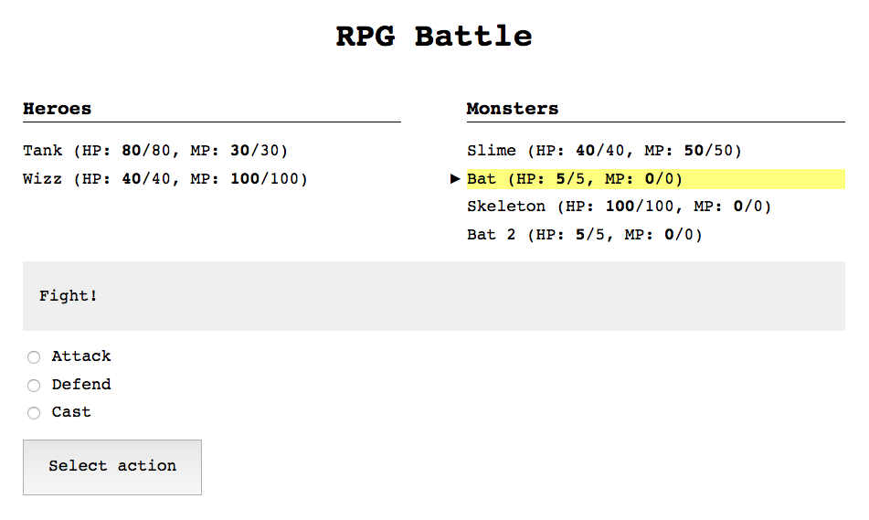

# Web client for RPG battles

Below is a breakdown of the proposed practice for this unit. After reading this formulation, we _strongly_ recommend looking up the **[practice guide](guia.md)** in order to accomplish it.

## Formulation

The practice consists of the implementation of a visual client (in this case, **a webpage**) for the battle game from the previous unit's practice.



As a starting point, we provide a <a href="start-here.zip" target="_blank">project framework</a> with the following files:

- `index.html`: starter HTML code
- `styles.css`: stylesheet
- `js/main.js`: starter JavaScript file
- `js/rpg.js`: a file with the code for the practice's battle library. You can also use your own code (check out the section _Adapting code from the previous practice_).

This starter code already implements the following:

- JavaScript and CSS resource loading from HTML file.

- HTML framework with a ready-made interface. You can modify this HTML to add extra bits, or change UI elements you do not like, but it is not necessary to do so.

- Creation of an instance of `Battle`, as well as party setup as well as subscription to the most relevant events. The info on said events is printed out on the console (you can remove or modify this as you like).

The following features need to be implemented:

- Display the characters in both parties, with their IDs, hit points, and mana points.

- Signal which character is selected, by changing her style or adding a special character (e.g., `*`).

- Signal which characters are dead, by changing their style or adding a special character (e.g., `✝`).

- Implement the battle menu with its following states: action selection, target selection, and spell selection.

- Display info feed on what has happened on each turn (e.g., `Bat attacked Wizz, but missed`).

- Display a message at the end of the battle, indicating which side is the victor.

In order to implement these basic features, it is advisable to follow the procedure outlined by the **[practice guide](GUIDE.md)**.

Some other features that could be optionally implemented would be:

- On the target selection menu, display characters belonging to different parties in different colors.

- On finishing the battle, display a button or link to start a new one (this can otherwise be done by simply reloading the page).

- The ability to randomize the makeup of either or both parties.

## Adapting code from the previous practice

The current version of JavaScript features no module management mechanisms (such as using the `require` function, as in Node). Due to this, we cannot use either `require`, or `module.exports`.

Additionally, certain parts that belong in the Node standard library, such as the event implementation module `events`, are not a part of the JavaScript standard.

There is a tool, [**Browserify**](http://browserify.org/), which allows us to transform Node modules –along with their dependencies– into code that can run on the browser. It also includes **polyfills**.

### Instructions

#### Option A: using our own code

If you have finished the previous practice, you can use that code in this one. Follow the steps below in order to adapt that code from Node into code you can run on the browser.

1. Since we are going to need two modules, `Battle` and `entities` (along with their dependencies), we need to create a "root" file with those two. Create an `export.js` file in the root of the previous practice's directory, with the following content:

    ```javascript
    module.exports = {
      "Battle": require('./src/Battle.js'),
      "entities": require('./src/entities.js')
    };
    ```

2. Again, in the root of the previous practice's directory, install Browserify with npm:

    ```
    npm install --save-dev browserify
    ```

3. Make sure that the `package.json` file has been modified and Browserify now appears listed within `devDependencies`. For instance:

    ```json
    "devDependencies": {
      "browserify": "^13.1.0"
    }
    ```

4. Edit `package.json` to add one more script command, which will launch Browserify:

    ```json
    "scripts": {
      "bundle": "browserify export.js --standalone RPG > rpg.js"
    }
    ```

5. Execute said command, which will generate an `rpg.js` file within the root of that directory.

    ```bash
    npm run bundle
    ```

6. Now you can copy `rpg.js` into the `js` directory from practice 2. When the file with the tag `<script>` is loaded into the browser, there will be an `RPG` global object, with two properties: `entities` and `Battle`.


#### Option B: using a third-party implementation

You can use the `rpg.js` file –which is already included in the starter source code–, which contains an implementation of the previous practice.

## Browser auto-reload

If you want the browser to **automatically reload** the page whenever you modify a file, you can do it easily enough by using [**Browsersync**](https://www.browsersync.io/). It is not mandatory, but you may be more comfortable programming this way.

You can install Browsersync globally (so that you can use it from any directory) via npm with the `-g` flag:

```bash
npm install -g browser-sync
```

Once installed, you can launch it from the practice's root directory. The following command launches browsersync, starts a local server and enables browser auto-reload whenever there is a change in the HTML, CSS or JavaScript files:

```bash
browser-sync start --server --files="*.html,js/*.js,*.css"
```

For further info, check out the [Browsersync documentation](https://www.browsersync.io/docs/command-line).
