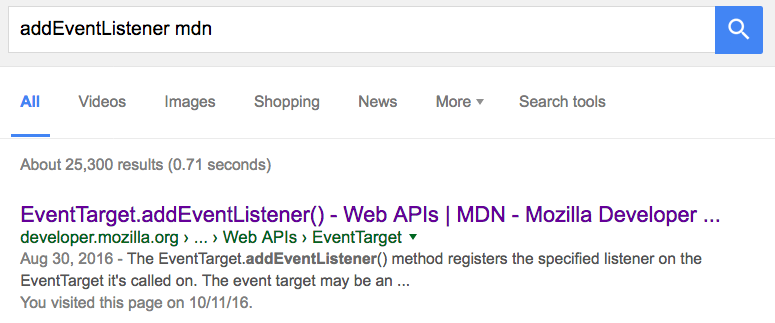

# The browser & DOM

## Why?

If you want to publish your games on the Web, you need to know how both the browser and the Web work.

**Browsers** are the environment where your games are going to run, and they bring a series of technical considerations to take into account, both in terms of interface and security. Additionally, browsers come with built-in **development tools** that will come in handy: a debugger, a profiler, a network traffic monitor, et cetera.

It is also necessary to have some knowledge of Web technologies, even if we are using a multiplatform engine and then exporting to HTML5:

- The game is always contained within a Webpage, and customizing its appearance may be of interest. In order to do this, it is necessary to use the HTML and CSS languages (for content and appearance, respectively).

- It is also useful in case we need to add certain elements that may not be supported by the exporter, such as a button that sets the game to run in fullscreen mode, or preloading Web fonts.

- Anytime we develop a multiplatform video game, it is likely for bugs specific to one platform to appear. In order to debug Web-specific bugs, you will need to use the tools provided by the browsers, as well as some measure of knowledge of the Web API the game uses (for instance, the Gamepad or WebGL APIs).

- If you are using a third-party engine or framework, and you need to fix a bug in said engine or implement a feature your game requires, you are obviously going to need Web programming knowledge.

## The browsers

A **browser** is a program that allows us to accesss the Web. Keep in mind not all browsers are equal, and despite the Web being based upon **open standards**, not all browsers implement these standards the same way.

From the developer's viewpoint, the most important components of a browser are:

- The **rendering engine**, which is in charge of "painting" a Webpage on the screen. Firefox uses Gecko, Safari uses Webkit, Chrome and Opera both use a Webkit fork called Blink, etc.

- The **JavaScript virtual machine**, which runs JavaScript code from the Webpage. Firefox uses SpiderMonkey, while Chrome and other browsers (as well as Node) use V8.

This results in **not all browsers supporting the same features**, as well as rendering engine or JavaScript virtual machine bugs which are specific to certain browsers.

In order to know which features are implemented by each browser, we can use, among others:

- [caniuse.com](http://caniuse.com), quick & intuitive
- [MDN](http://developer.mozilla.org), has specific details on implementation and differences between browsers

## Languages of the Web

### HTML

HTML (HyperText Markup Language) is used in order to create the **content** of a Webpage: paragraphs, headers, images, videos, etc.

It is a tag-based markup language. For instance:

```html
<h1>This is a header</h1>
```

### CSS

CSS (Cascading Style Sheets) is used for customizing the **appearance** of HTML elements: colors, backgrounds, borders, their position on the page, column divisions, size, margins, etc.

It is a rule-based declarative language. For instance:

```css
h1 {
  color: red; /* makes h1 elements display as red text */
}
```

### JavaScript

JavaScript is an interpreted programming language, and we use it to implement the **logics and behavior** of a Webpage, should it be needed.

It is a prototype-oriented, **dynamic language**, with functional features.

```javascript
console.log("Hello, world!");
```

## What happens when we access a page from a browser?

Understanding how network traffic works at a basic level is necessary in order to understand –as well as being able to fix or mitigate– certain situations. For instance; why a game may be taking too long to load, why certain assets are not loaded, how to prevent the page from going blank while the game is loading, etc.

Now we shall take a step-by-step look at this flow.

### Step 1. HTTP GET server request


The browser sends an **HTTP GET request** to a URL (which identifies a resource's location on the Web) and, should a resource exist there, the server returns it.

Keep in mind browsers feature a cache memory; therefore, if the resource is already in cache and has not yet expired, they use the cached resource instead of sending a request.

### Step 2. File download


HTML files may reference other resources… resources the browser will have to request from the server. If we have requested an HTML file, it will **download and render** on the fly.

When a JS file is done downloading, its code is parsed and **run**. While it is being run, the browser is _locked up_.

### Step 3. Loading finished

When all of the images, scripts, CSS, etc., are loaded, the **`load` event** is fired. `load` is an event of `window`, a global object defined in the JavaScript standard that comes built into browsers.

It is very common to include the code that initializes the program execution within this event's handler.

```javascript
window.onload = function () {
  // Initialize the program
};
```

## How to include JavaScript within a Webpage

A Webpage is, at its core, an HTML file that may include other resources, such as the CSS style sheets, or JavaScript code.

### Basic structure of an HTML document

Here goes an example of an HTML document with a bit of content; in this case, a header (`<h1>`) and a paragraph (`<p>`).

```html
<!doctype html>
<html>
  <!-- the head is metadata -->
  <head>
    <title>Cancamusa</title>
    <meta charset="utf-8">
  </head>
  <!-- the body is content -->
  <body>
    <h1>Monkey Island</h1>
    <p>Look behind you, a Three-Headed Monkey!</p>
  </body>
</html>
```

As you can see, HTML is based around the inclusion of tags within other tags. There is a root tag, `<html>`, which in turn contains two tags, `<head>` & `<body>`. Both of these tags are **necessary** to any Webpage.

You may also have noticed a special tag on the first line:

```html
<!doctype html>
```

With this, we effectively tell the browser we are using an HTML5 or higher format (there used to be other standards, such as XHTML).

`<head>` includes page-related **metadata**, such as its title (which displays on browser tabs, or search results in Google and other search engines), character encoding, etc. Here we can also include other files, such as CSS style sheets.

`<body>` holds the page **content**, what the user is seeing. The prior example shows a header element and a paragraph element.

### Where do we put JavaScript code?

We can include JavaScript files (as well as inline code) both within the `<head>` and the `<body>`, but this affects the way the page is loaded.

By default, when a JavaScript file starts loading the browser stops rendering the HTML document until the JavaScript file is completely downloaded, parsed and executed.

Therefore, if we download it at the start (in the `<head>` or at the beginning of `<body>`), it is possible for the Webpage to display as a blank, or to delay the load of some assets that may actually be more important.

Should we, to the contrary, include the JavaScript element at the end of  `<body>`, the Webpage will be rendered in full (which means the user may see _something_), but the file will take longer to execute.

There is no optimal solution for all possible cases. Depending on the video game's characteristics (or the page's), different loading points will be more or less desirable.

<small>Note: this was but a very simplified explanation. You can find more complete information in [this article by Jake Archibald](https://www.html5rocks.com/en/tutorials/speed/script-loading/).</small>

### Inline & external scripts

We can include inline JavaScript code within the HTML document with the tag, `<script>`.

```html
<script>
    console.log("Hello, world!");
</script>
```

We can also contain the JavaScript code within a separate `.js` file. These files are included with the `<script>` tag:

```html
<script src="js/game.js"></script>
```

## How JavaScript code is executed

### Event-based asynchronous model

Within the browser, JavaScript follows an event-based **asynchronous model**. Keep in mind that, while the JavaScript code is being executed, the browser keeps everything else **locked up**, including the UI (user interface).

The asynchronous model allows us to program JavaScript in such a fashion that these lockups are unnoticeable to the user. The idea is not to have JavaScript code constantly running (which would lock the interface up), but rather to **subscribe to certain events** and only run code when these events are triggered.

Logically, it is our responsibility for the code not to take too long to execute, as the user would then notice that the browser has frozen. In addition, browsers usually stop (or allow the users to do so) JavaScript scripts that have not finished running after a certain amount of time.

Some examples of events we can subscribe to are: the page loading, clicking on a button or a link, hovering the mouse over an item, certain content finishing loading, etc. We can also fire our own customized events.

### A single thread

Another aspect that is worth considering is that, _usually_, our JavaScript code will run on **a single thread** (there are some exceptions, such as WebWorkers). This is the reason that, if there are two subscriptions to a single event, they will _not_ be executed simultaneously, but sequentially. And while an event is executing, the rest of the code _waits_.

Check out this example:

```javascript
button.onclick = function (evt) {
    console.log("Click");
}

// ...

button.trigger('click');
// the button does not deactivate until the "click" handler
// has finished executing
button.disabled = true;
```

You can also access this [code snippet](https://jsfiddle.net/1wqevdob/) online.

## The DOM

HTML documents present a **tree structure**. By including tags within other tags, we have a hierarchical relation, since some elements are "parents" to others.

For instance, let us consider the following piece of HTML code:

```html
<article>
  <header>
    <h1>An awesome header</h1>
  </header>
  <p>Blah blah, yadda-yadda.</p>
  <p>
    More blah, and then
    <a href="http://wikipedia.org">here's a link</a>.
  </p>
</article>
```

Its representation as a tree would be as follows:


DOM, short for Document Object Model, is an **interface** browsers implement so that we can **interact with the tree above**, as well as the HTML elements that populate it. We can manipulate HTML elements (by changing their content, their properties or calling their own methods), as well as manipulate the tree itself by inserting, replacing or removing elements.

## Accessing DOM elements

Accessing one (or several) elements in the DOM is one of the most frequently performed operations.

### By ID

It selects only one element (IDs must be unique), according to its `id` HTML attribute:

```html
<button id="show-fullscreen">Fullscreen</button>
```

```javascript
var button = document.getElementById('show-fullscreen');
```

### By CSS selector

This form uses the syntax of CSS selectors in order to locate one (or several) elements.

```javascript
// selects the first paragraph it finds
var paragraph = document.querySelector('p');
// selects the first element in the .warning class
var label = document.querySelector('.warning');
// selects ALL paragraphs
var allPars = document.querySelectorAll('p');
```

<small>You can find more info on CSS selectors to use with `querySelector` in [the MDN](https://developer.mozilla.org/en-US/docs/Web/Guide/CSS/Getting_Started/Selectors).</small>

### Iterating on an element list

We need to keep in mind that `querySelectorAll` does _not_ return an array, but a [`NodeList`](https://developer.mozilla.org/en/docs/Web/API/NodeList), which is a different object.

We cannot use methods from `Array` on a `NodeList`; however, they do have the property `length` and the operator `[]`, so we can iterate upon it by means of a loop:

```javascript
var buttons = document.querySelectorAll('button');
for (var i = 0; i < buttons.length; i++) {
    buttons[i].style = "display: none"; // hide buttons
}
```

<small>Though we can also iterate with `Array.forEach`, if we use it with `apply`…</small>

### Navigating the DOM tree

Once we have accessed an element, we can navigate –that is to say, traverse– the DOM tree starting from there.

- An element's **parent** node is accessed through the `parentNode` property.
- The list of **child** nodes of an element is accessed with `childNodes`.
- An element's previous or next **sibling** nodes are accessed with `previousSibling` and `nextSibling`.

This way, we can traverse the DOM in any direction.

## Interesting properties of DOM elements

### `innerHTML`

This is the _inside_, or content, of the element. There can be anything from simple plain text to HTML code. In the case we were using HTML code, we would in fact be creating new HTML elements within the DOM, on the fly.

```javascript
button.innerHTML = 'Accept';
// -> <button>Accept</button>
p.innerHTML = 'Paragraph with <b>bold</b>';
// -> <p>Paragraph with <b>bold</b></p>
```

### `style`

`style` allows us to apply **inline CSS styles**. These styles get maximum priority, which makes them extremely useful when hiding/displaying elements, for instance.

```javascript
var previousDisplay = button.style.display;
button.style="display:none"; // hides any element
button.style="display:inline-block;" // displays the button
```
<small>Note: `display:none` is universal, but in order to display an element we have to choose one from among several values; the most frequent of these are `inline`, `inline-block` & `block`, but there are others.</small>

### `classList`

`classList` allows us to access an element's **CSS classes**, enabling the addition, removal or switching (_toggling_) of classes. This is very useful when we want to change the way the UI looks according to the user's interactions.

```javascript
button.classList.add('loading');
button.classList.remove('loading');
button.classList.contains('loading'); // query
button.classList.toggle('loading'); // doesn't work on IE
```

Example: Online [code snippet](https://developer.mozilla.org/en/docs/Web/API/Element/classList).

## Altering the DOM

Altering the DOM (i.e., inserting and removing elements) allows us to dynamically alter the contents of a webpage.

### Inserting elements

We have already seen how we can insert new HTML elements through the `innerHTML` property, but we can also create them from scratch with `createElement`:

```javascript
var button = document.createElement('button');
button.innerHTML = 'Start';
button.setAttribute('type', 'button');

// <button type="button">Start</button>
```

It is important to keep in mind that whenever we create an element with `createElement`, it is **orphaned** and will not render on the page. For it to appear, we have to add it to the DOM as a "relative" of some other element by using [`appendChild`](https://developer.mozilla.org/en/docs/Web/API/Node/appendChild), [`insertBefore`](https://developer.mozilla.org/en-US/docs/Web/API/Node/insertBefore), etc.

```javascript
document.body.appendChild(button);
```

Example: Online [code snippet](https://jsfiddle.net/mpsjmz11/1/).

### Removing elements

In order to remove an element from the DOM, we can either replace it with another (by using `replaceChild`) or delete it altogether.

The same way we can create elements by inserting a string with HTML code within the `innerHTML` property, we can also remove all of the children –and content– of an element by assigning a void string to `innerHTML`:

```javascript
document.body.innerHTML = ''; // remove all of the body content
```

We can also remove an element from the DOM with `remove`, or one of its children with `removeChild`:

```javascript
var button = document.querySelector('button');
button.remove();
```

## Events

DOM events are a keystone of Web programming, since they are the way for us to program a webpage's behavior without locking up the UI.

DOM elements fire events we can subscribe to; then we can execute the behavior we want to associate to that action: clicking on a button, a a change in the text of an `<input>`, selecting a checkbox, etc.

Events can be fired not only be HTML elements, but also other global objects such as `window`, `load`, `resize`, etc.

There are two ways to listen for (or subscribe to) DOM events:

- By using the `Event.addEventListener` method
- By using the **on-event handlers** (e.g.: `onclick`, `onfocus`, etc.)

### On-event handlers

**On-event handlers** were originally the only way to subscribe to events, though nowadays we have an alternative in `addEventListener`. The drawback to using an on-event handler is that we can only have **a single handler** (that is to say, the code that will be run when the event is fired) per event.

We subscribe and unsubscribe with handlers through **assignment**:

```javascript
// subscription
button.onclick = function (evt) { /* ... */ };
// cancelling the subscription
button.onclick = null;
```

Documentation [on the MDN](https://developer.mozilla.org/en-US/docs/Web/Guide/Events/Event_handlers).

### Event listeners

We can use **event listeners** to subscribe more than once to the same event, thereby associating several behaviors to a single action.

This is the **safest and most recommended** way, especially if using third-party code, since it would prevent us from accidentally removing an existing handler.

In order to subscribe to an event we use the `addEventListener` method, and in order to cancel the subscription we use `removeEventListener` (to which we pass the callback function so that it can know which specific subscription it has to cancel).

```javascript
var sayHi = function () { /* */ };
// subscription
button.addEventListener('click', sayHi);
// cancelling subscription
button.removeEventListener('click', sayHi);
```

Documentation [on the MDN](https://developer.mozilla.org/en-US/docs/Web/API/EventTarget/addEventListener).


### _Bubbling_

**Bubbling** is the metaphor we employ in order to explain how DOM events behave.

Whenever an element fires an event, **it propagates** upwards through the DOM tree, as if it were a bubble. That is to say; if a given element fires an event, it can be seen by said element's parent node as well as all other ancestors.

Consider the following code: if the user clicks the button, the `click` event would be fired and we could subscribe to it both from the `<button>` and `<section>` elements – as is the case here.

```html
<section>
    <button>Click me</button>
</section>
```

```javascript
var section = document.querySelector('section')
section.addEventListener('click', function () {
    console.log('Clicked…');
});
```

You can try this [code snippet](https://jsfiddle.net/mcx0hkou/1/) online.

### Interrupting bubbling

Sometimes we do not want an event to propagate, or to make it so that it only does so partially.

Event **callbacks** can receive **an argument**, which will be an `Event`-type object and contains information about the event (such as the element that fired it in the first place), as well as methods. One of these methods, `stopPropagation`, interrupts bubbling.

```javascript
button.addEventListener('click', function (evt) {
    evt.stopPropagation();
});
```

### Cancelling an event

We may also need to **cancel the event** in order to prevent its default associated actions from happening (for instance: sending a form, or changing the page when clicking on a link).

Do notice that this is not an interruption of bubbling. Once fired, the event has already happened and its propagation has begun. In order to prevent bubbling we need to use `Event.stopPropagation`, as seen above.

We cancel events by using `Event.preventDefault`:

```html
<a href="file.zip" download>Download zip</a>
```

```javascript
var link = document.querySelector('a');
link.addEventListener('click', function (evt) {
    // the browser will not notice that the link has been clicked
    evt.preventDefault();
});
```

**Warning**: great care has to be exercised when using `preventDefault`, since we can worsen the user experience. Cancelling links is usually a bad idea; disabling right-button clicks so that the user will be unable to save an image is even worse.

Legitimate uses of `preventDefault` could be: validating a form in the client before submitting it, disabling certain keyboard actions –for instance, scrolling down with the spacebar– for a video game that uses those keys, etc.

## Documentation on the MDN

Documentation for everything we have seen can be found in the Mozilla Developer Network (MDN): [http://developer.mozilla.org](http://developer.mozilla.org)

A useful trick for quicker access to the MDN from a search engine is to add `mdn` to any search:


