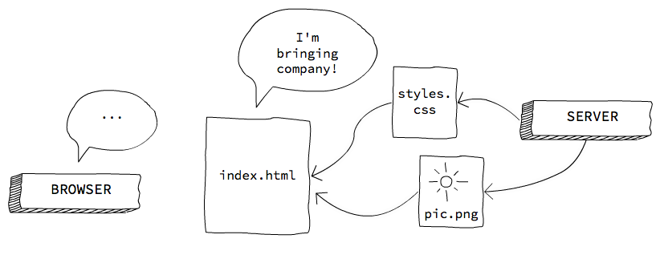
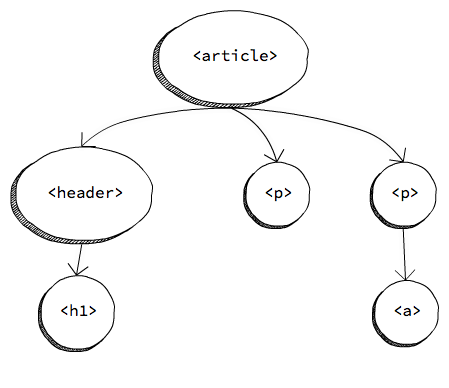

# The browser & DOM

## Why?

If you want to publish your games on the Web, you need to know how both the browser and the Web work.

**Browsers** are the environment where your games are going to run, and they bring a series of technical considerations to take into account, both in terms of interface and security. Additionally, browsers come with built-in **development tools** that will come in handy: a debugger, a profiler, a network traffic monitor, et cetera.

It is also necessary to have some knowledge of Web technologies, even if we are using a multiplatform engine and then exporting to HTML5:

- The game is always contained within a Webpage, and customizing its appearance may be of interest. In order to do this, it is necessary to use the HTML and CSS languages (for content and appearance, respectively).

- It is also useful in case we need to add certain elements that may not be supported by the exporter, such as a button that sets the game to run in fullscreen mode, or preloading Web fonts.

- Anytime we develop a multiplatform video game, it is likely for bugs specific to one platform to appear. In order to debug Web-specific bugs, you will need to use the tools provided by the browsers, as well as some measure of knowledge of the Web API the game uses (for instance, the Gamepad or WebGL APIs).

- If you are using a third-party engine or framework, and you need to fix a bug in said engine or implement a feature your game requires, you are obviously going to need Web programming knowledge.

## The browsers

A **browser** is a program that allows us to accesss the Web. Keep in mind not all browsers are equal, and despite the Web being based upon **open standards**, not all browsers implement these standards the same way.

From the developer's viewpoint, the most important components of a browser are:

- The **rendering engine**, which is in charge of "painting" a Webpage on the screen. Firefox uses Gecko, Safari uses Webkit, Chrome and Opera both use a Webkit fork called Blink, etc.

- The **JavaScript virtual machine**, which runs JavaScript code from the Webpage. Firefox uses SpiderMonkey, while Chrome and other browsers (as well as Node) use V8.

This results in **not all browsers supporting the same features**, as well as rendering engine or JavaScript virtual machine bugs which are specific to certain browsers.

In order to know which features are implemented by each browser, we can use, among others:

- [caniuse.com](http://caniuse.com), quick & intuitive
- [MDN](http://developer.mozilla.org), has specific details on implementation and differences between browsers

## Languages of the Web

### HTML

HTML (HyperText Markup Language) is used in order to create the **content** of a Webpage: paragraphs, headers, images, videos, etc.

It is a tag-based markup language. For instance:

```html
<h1>This is a header</h1>
```

### CSS

CSS (Cascading Style Sheets) is used for customizing the **appearance** of HTML elements: colors, backgrounds, borders, their position on the page, column divisions, size, margins, etc.

It is a rule-based declarative language. For instance:

```css
h1 {
  color: red; /* makes h1 elements display as red text */
}
```

### JavaScript

JavaScript is an interpreted programming language, and we use it to implement the **logics and behavior** of a Webpage, should it be needed.

It is a prototype-oriented, **dynamic language**, with functional features.

```javascript
console.log("Hello, world!");
```

## What happens when we access a page from a browser?

Understanding how network traffic works at a basic level is necessary in order to understand –as well as being able to fix or mitigate– certain situations. For instance; why a game may be taking too long to load, why certain assets are not loaded, how to prevent the page from going blank while the game is loading, etc.

Now we shall take a step-by-step look at this flow.

### Step 1. HTTP GET server request


The browser sends an **HTTP GET request** to a URL (which identifies a resource's location on the Web) and, should a resource exist there, the server returns it.

Keep in mind browsers feature a cache memory; therefore, if the resource is already in cache and has not yet expired, they use the cached resource instead of sending a request.

### Step 2. File download



HTML files may reference other resources… resources the browser will have to request from the server. If we have requested an HTML file, it will **download and render** on the fly.

When a JS file is done downloading, its code is parsed and **run**. While it is being run, the browser is _locked up_.

### Step 3. Loading finished

When all of the images, scripts, CSS, etc., are loaded, the **`load` event** is fired. `load` is an event of `window`, a global object defined in the JavaScript standard that comes built into browsers.

It is very common to include the code that initializes the program execution within this event's handler.

```javascript
window.onload = function () {
  // Initialize the program
};
```

## How to include JavaScript within a Webpage

A Webpage is, at its core, an HTML file that may include other resources, such as the CSS style sheets, or JavaScript code.

### Basic structure of an HTML document

Here goes an example of an HTML document with a bit of content; in this case, a header (`<h1>`) and a paragraph (`<p>`).

```html
<!doctype html>
<html>
  <!-- the head is metadata -->
  <head>
    <title>Cancamusa</title>
    <meta charset="utf-8">
  </head>
  <!-- the body is content -->
  <body>
    <h1>Monkey Island</h1>
    <p>Look behind you, a Three-Headed Monkey!</p>
  </body>
</html>
```

As you can see, HTML is based around the inclusion of tags within other tags. There is a root tag, `<html>`, which in turn contains two tags, `<head>` & `<body>`. Both of these tags are **necessary** to any Webpage.

You may also have noticed a special tag on the first line:

```html
<!doctype html>
```

With this, we effectively tell the browser we are using an HTML5 or higher format (there used to be other standards, such as XHTML).

`<head>` includes page-related **metadata**, such as its title (which displays on browser tabs, or search results in Google and other search engines), character encoding, etc. Here we can also include other files, such as CSS style sheets.

`<body>` holds the page **content**, what the user is seeing. The prior example shows a header element and a paragraph element.

### Where do we put JavaScript code?

We can include JavaScript files (as well as inline code) both within the `<head>` and the `<body>`, but this affects the way the page is loaded.

By default, when a JavaScript file starts loading the browser stops rendering the HTML document until the JavaScript file is completely downloaded, parsed and executed.

Therefore, if we download it at the start (in the `<head>` or at the beginning of `<body>`), it is possible for the Webpage to display as a blank, or to delay the load of some assets that may actually be more important.

Should we, to the contrary, include the JavaScript element at the end of  `<body>`, the Webpage will be rendered in full (which means the user may see _something_), but the file will take longer to execute.

There is no optimal solution for all possible cases. Depending on the video game's characteristics (or the page's), different loading points will be more or less desirable.

<small>Note: this was but a very simplified explanation. You can find more complete information in [this article by Jake Archibald](https://www.html5rocks.com/en/tutorials/speed/script-loading/).</small>

### Inline & external scripts

We can include inline JavaScript code within the HTML document with the tag, `<script>`.

```html
<script>
    console.log("Hello, world!");
</script>
```

We can also contain the JavaScript code within a separate `.js` file. These files are included with the `<script>` tag:

```html
<script src="js/game.js"></script>
```

## How JavaScript code is executed

### Event-based asynchronous model

Within the browser, JavaScript follows an event-based **asynchronous model**. Keep in mind that, while the JavaScript code is being executed, the browser keeps everything else **locked up**, including the UI (user interface).

The asynchronous model allows us to program JavaScript in such a fashion that these lockups are unnoticeable to the user. The idea is not to have JavaScript code constantly running (which would lock the interface up), but rather to **subscribe to certain events** and only run code when these events are triggered.

Logically, it is our responsibility for the code not to take too long to execute, as the user would then notice that the browser has frozen. In addition, browsers usually stop (or allow the users to do so) JavaScript scripts that have not finished running after a certain amount of time.

Some examples of events we can subscribe to are: the page loading, clicking on a button or a link, hovering the mouse over an item, certain content finishing loading, etc. We can also fire our own customized events.

### A single thread

Another aspect that is worth considering is that, _usually_, our JavaScript code will run on **a single thread** (there are some exceptions, such as WebWorkers). This is the reason that, if there are two subscriptions to a single event, they will _not_ be executed simultaneously, but sequentially. And while an event is executing, the rest of the code _waits_.

Check out this example:

```javascript
button.onclick = function (evt) {
    console.log("Click");
}

// ...

button.trigger('click');
// the button does not deactivate until the "click" handler
// has finished executing
button.disabled = true;
```

You can also access this [code snippet](https://jsfiddle.net/1wqevdob/) online.

## El DOM

Los documentos HTML presentan una **estructura de árbol**. Al incluir unas etiquetas dentro de otras, tenemos una relación jerárquica, ya que algunos elementos son "padres" de otros.

Por ejemplo, pongamos el siguiente fragmento de código HTML:

```html
<article>
  <header>
    <h1>Un título molón</h1>
  </header>
  <p>Bla bla bla.</p>
  <p>
    Más bla, bla, bla y
    <a href="http://wikipedia.org">aquí un enlace</a>.
  </p>
</article>
```

Su representación en forma de árbol sería la siguiente:



El DOM (_Object Document Model_) es una **interfaz** que implementan los navegadores para que podamos **interactuar con dicho árbol** y con los elementos HTML que lo pueblan. Podemos tanto manipular los elementos HTML (cambiando su contenido, sus propiedades o bien llamando sus métodos propios), como manipular el árbol en sí, insertando, cambiando e eliminando elementos.

## Acceder a elementos del DOM

Acceder a un elemento (o varios) del DOM es una de las operaciones más frecuentes que se hacen.

### Por ID

Sólo selecciona un elemento (los ID deben ser únicos), en base a su atributo `id` de HTML:

```html
<button id="show-fullscreen">Fullscreen</button>
```

```javascript
var button = document.getElementById('show-fullscreen');
```

### Acceder a elementos por selector CSS

Esta forma usa la sintaxis de los selectores CSS para localizar uno (o varios) elementos.

```javascript
// selecciona el primer párrafo que encuentra
var paragraph = document.querySelector('p');
// selecciona el primer elemento con clase .warning
var label = document.querySelector('.warning');
// selecciona TODOS los párrafos
var allPars = document.querySelectorAll('p');
```

<small>Puedes encontrar más información sobre selectores CSS para usar con `querySelector` en [la MDN](https://developer.mozilla.org/en-US/docs/Web/Guide/CSS/Getting_Started/Selectors).</small>

### Iterar sobre una lista de elementos

Hay que tener en cuenta que `querySelectorAll` _no_ devuelve un array, sino una [`NodeList`](https://developer.mozilla.org/en/docs/Web/API/NodeList), que es un objeto diferente.

No podemos utilizar métodos de `Array` sobre una `NodeList`, pero tiene la propiedad `length` y el operador `[]`, así que podemos iterar sobre ella mediante un bucle:

```javascript
var buttons = document.querySelectorAll('button');
for (var i = 0; i < buttons.length; i++) {
    buttons[i].style = "display: none"; // hide buttons
}
```

<small>Aunque también podemos iterar con `Array.forEach` si lo utilizamos con `apply`…</small>


### Navegar el árbol del DOM

Una vez que hemos accedido a un elemento, podemos navegar –recorrer- el árbol del DOM a partir de él.

- Se accede al **padre** de un elemento con la propiedad `parentNode`.
- Se accede a la lista de **hijos** de un elemento con `childNodes`.
- Se accede al **hermano** anterior o siguiente con `previousSibling` y `nextSibling`.

Con esto podemos recorrer todo el DOM en cualquier dirección.

## Propiedades interesantes de elementos del DOM

### `innerHTML`

Es el _interior_ o contenido del elemento. Puede haber desde simplemente texto, hasta código HTML. Si usamos código HTML, estaríamos de hecho creando nuevos elementos HTML en el DOM al vuelo.

```javascript
button.innerHTML = 'Aceptar';
// -> <button>Aceptar</button>
p.innerHTML = 'Párrafo con <b>negrita</b>';
// -> <p>Párrafo con <b>negrita</b></p>
```

### `style`

`style` nos permite aplicar **estilos CSS inline**. Estos estilos tienen la máxima prioridad, así que son muy útiles para ocultar/mostrar elementos, por ejemplo.

```javascript
var previousDisplay = button.style.display;
button.style="display:none"; // oculta cualquier elemento
button.style="display:inline-block;" // muestra el botón
```
<small>Nota: `display:none` es universal, pero para mostrar un elemento se ha de elegir entre varios valores, los más comunes son `inline`, `inline-block` y `block`, pero hay otros.</small>

### `classList`

`classList` nos permite acceder a las **clases CSS** de un elemento, pudiendo añadir, quitar o alternar (_toggle_) clases. Esto es muy útil para cambiar el aspecto de la UI en función de las interacciones del usuario.

```javascript
button.classList.add('loading');
button.classList.remove('loading');
button.classList.contains('loading'); // query
button.classList.toggle('loading'); // doesn't work on IE
```

Ejemplo: [_snippet_ de código](https://developer.mozilla.org/en/docs/Web/API/Element/classList) online.

## Manipular el DOM

Manipular el DOM (esto es, insertar y eleminar elementos) nos permite alterar dinámicamente el contenido de una página web.

### Insertar elementos

Ya hemos visto que se pueden insertar elementos HTML nuevos a través de la propiedad `innerHTML`, pero también los podemos crear desde cero, con `createElement`:

```javascript
var button = document.createElement('button');
button.innerHTML = 'Start';
button.setAttribute('type', 'button');

// <button type="button">Start</button>
```

Es importante tener en cuenta que cuando creamos un elemento con `createElement` este se encuentra **huérfano** y no lo veremos renderizado en la página. Para que aparezca, hay que añadirlo al DOM como "familiar" de algún otro elemento –usando para ello [`appendChild`](https://developer.mozilla.org/en/docs/Web/API/Node/appendChild), [`insertBefore`](https://developer.mozilla.org/en-US/docs/Web/API/Node/insertBefore), etc.

```javascript
document.body.appendChild(button);
```

Ejemplo: [_snippet_ de código](https://jsfiddle.net/mpsjmz11/1/) online.

### Eliminar elementos

Para eliminar un elemento del DOM, bien podemos reemplazarlo por otro –usando `replaceChild`, o bien podemos eliminarlo del todo.

Del mismo modo que se pueden crear elementos insertando una string con código HTML en la propiedad `innerHTML`, también se pueden eliminar todos los hijos –y contenido– de un elemento asignando una cadena vacía a `innerHTML`:

```javascript
document.body.innerHTML = ''; // remove all the body content
```

También podemos eliminar un elemento del DOM con `remove`, y un hijo suyo con `removeChild`:

```javascript
var button = document.querySelector('button');
button.remove();
```

## Eventos

Los eventos del DOM son una parte crucial de la programación web, ya que es la manera que tenemos de programar el comportamiento de una página web sin bloquear la UI.

Los elementos del DOM disparan eventos a los que podemos subscribirnos, y ejecutar entonces el comprtamiento que queremos asociado a dicha acción. Por ejemplo, un click en un botón, un cambio del texto de un `<input>`, cuando se selecciona una checkbox, etc.

No sólo los elementos HTML disparan eventos, sino que otros objetos globales, como `window`, también lo hacen Por ejemplo: `load`, `resize`, etc.

Hay dos maneras de escuchar (o subscribirse a) eventos del DOM:

- Usando el método `Event.addEventListener`
- Usando los _on-event handlers_ (p. ej: `onclick`, `onfocus`, etc.)

### _On-event handlers_

Los _on-event handlers_ eran originalmente la única manera de subscribirse a eventos, aunque hoy en día disponemos de la alternativa de `addEventListener`. El inconveniente de usar un _on-event handler_ es que sólo podemos tener **un único _handler_** (es decir, el código que se ejecutará cuando el evento se dispara) por evento.

La manera de subscribirse y cancelar la subscribpción con _handlers_ es mediante una **asignación**:

```javascript
// subscripción
button.onclick = function (evt) { /* ... */ };
// cancelar la subscripción
button.onclick = null;
```

Documentación [en la MDN](https://developer.mozilla.org/en-US/docs/Web/Guide/Events/Event_handlers).

### _Event listeners_

Usando _event listeners_ podemos **subscribirnos varias veces** al mismo evento, pudiendo tener varios comportamientos asociados a una misma acción.

Esta es la manera **recomendada y más segura**, especialmente si se usa código de terceros, ya que no podríamos eliminar de manera accidental un _handler_ existente.

Para subscribirnos a un evento usamos el método `addEventListener`, y para cancelar la subscripción usamos `removeEventListener` (al que hay que pasarle la función de callback para que sepa qué subscripción en particular cancelar).

```javascript
var sayHi = function () { /* */ };
// subscripción
button.addEventListener('click', sayHi);
// cancelar la subscripción
button.removeEventListener('click', sayHi);
```

Documentación [en la MDN](https://developer.mozilla.org/en-US/docs/Web/API/EventTarget/addEventListener).


### _Bubbling_

El **_bubbling_** es la metáfora con la que explicamos cómo se comportan los eventos del DOM.

Cuando un elemento dispara un evento, **se propaga** hacia arriba en el árbol del DOM, como si fuera una burbuja. Es decir, que un evento disparado por un elemento en concreto, podrá ser visto también por su nodo padre y el resto de sus ancestros.

Por ejemplo, en el siguiente código, si el usuario hace click en el botón se dispararía el evento `click`, al que podríamos subscribirnos tanto desde el `<button>` como desde la `<section>` –como ocurre en este caso.

```html
<section>
    <button>Click me</button>
</section>
```

```javascript
var section = document.querySelector('section')
section.addEventListener('click', function () {
    console.log('Clicked…');
});
```

Puedes probar un [_snippet_ de código](https://jsfiddle.net/mcx0hkou/1/) online.

### Interrumpir el _bubbling_

Hay veces que no nos interesa que se produzca esta propagación, o sólo queremos que se produzca de forma parcial.

Los _callbacks_ de los eventos pueden recibir **un argumento**, que será un objeto de tipo `Event` y contiene información sobre el evento (como el elemento originario de que se disparase), así como métodos. Uno de estos métodos, `stopPropagation`, interrumpe el _bubbling_.

```javascript
button.addEventListener('click', function (evt) {
    evt.stopPropagation();
});
```

### Cancelar el evento

También puede ocurrir que necesitemos **cancelar el evento** para evitar las acciones por defecto asociadas a él (por ejemplo, el envío de un formulario, o el cambio de página al hacer click en un enlace).

Nótese que esto _no_ es interrumpir el _bubbling_. Una vez disparado, el evento ya se ha producido y ya ha comenzado su propagación. Para interrumpir el _bubbling_ debemos usar `Event.stopPropagation`, como ya hemos visto.

Los eventos se cancelan usando `Event.preventDefault`:

```html
<a href="file.zip" download>Download zip</a>
```

```javascript
var link = document.querySelector('a');
link.addEventListener('click', function (evt) {
    // the browser won't detect the link has been clicked
    evt.preventDefault();
});
```

**Aviso**: hay que tener mucho cuidado al hacer `preventDefault`, puesto que podemos empeorar la experiencia de usuario. Cancelar los links suele ser una mala idea, anular los clicks con el botón derecho para que el usuario no pueda guardar una imagen es una idea aún peor.

Usos legítimos de `preventDefault` podrían ser: validar un formulario en el cliente antes de enviarlo, anular ciertas acciones del teclado –por ejemplo, scroll hacia abajo con la barra espaciadora– en un videojuego que use esa tecla, etc.

## Documentación en la MDN

La documentación de todo lo que se ha visto está en la Mozilla Developer Network (MDN): [http://developer.mozilla.org](http://developer.mozilla.org)

Un truco para acceder más rápidamente a la MDN desde un buscador, es añadir `mdn` a cualquier búsqueda:


